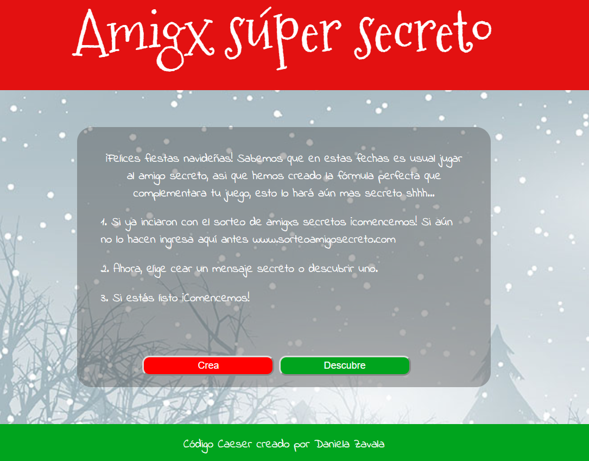
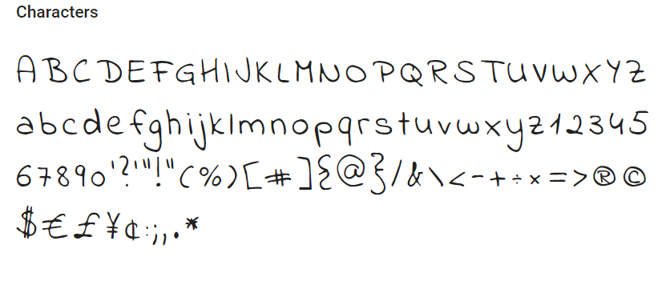
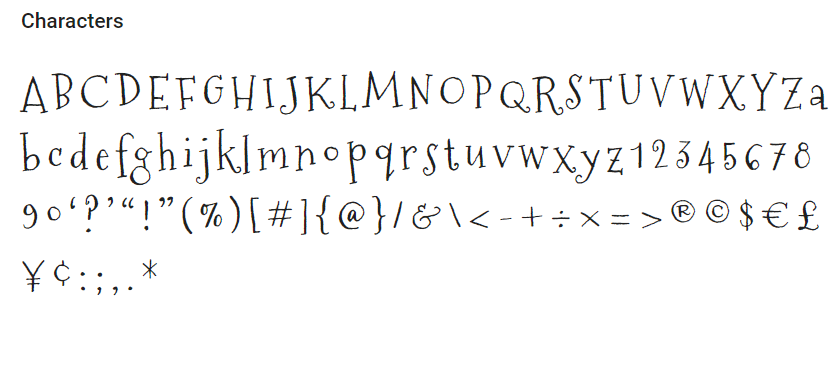

# Amigo súper secreto

Sorteo Amigo Secreto. El sorteo de [Amigo secreto](https://www.sorteoamigosecreto.com) es un juego para la Navidad. Se trata de asignar al azar un amigo a cada uno de los participantes. Cada uno de los participantes entonces tiene que hacer una carta a su amigo secreto, y a la vez, recibirá un carta de alguien que no sabe quién es. En esta oportunidad hemos reinventado al Amigo secreto por Amigx súper secreto, un formato digital del juego.

## ¿A quiénes esta dirijido? - Usuarios
_Amigo súper secreto_ es un sitio web de entretenimiento, dirijido a quienes embargados por los sentimiento de visperas de navidad promueven juegos de confraternidad. Comunmente se jugaba al Amigo secreto en colegios, universidades, centros de trabajos y otros grupos sociales, pero vamos... ¿Aún se escriben cartas en estos tiempos? Esto nos lleva a querer innovar el juego enfocados en la evolución del comportamiento de los usuarios, algunas caracteristicas puntuales son: tecnologia, inmediatez, practicidad.

## ¿Qué buscan? - Objetivos
La esencia de este juego es mantener el secreto de quién es la persona que redacta el mensaje, probablemente una caligrafía facilmente nos ayudaria a detectar quién es el redactor de una carta, y justamente eso es lo que no sucedera en _Amigx super secreto_. Aquí quien emite el mensaje no se verá expuesto a que alguien externo a la pareja con la que realmente le toca jugar pueda entender lo que dice su mensaje a simple vista, esto con el fin de evitar cualquier situación que eche a perder el secretismo que caracteriza a este juego.  También hemos detectado que el usuario espera formar parte de este juego sin que este interfiera con sus obligaciones cotidianas al mismo tiempo.

## ¿Qué ofrecemos? - Solución
_Amigx súper secreto_ resuelve de manera sencilla cómo no dejarnos absorber por la rutina y poder participar en un juego tradicional, y al mismo tiempo ofrece otras herramientas que haran que el juego se mantenga vigente durante unos años más. El juego le permite al usuario imprimir el mensaje cifrado o enviarlo a través de la dirección del sitio, hola@amigxsecreto.com, para que no pierda el sentido de ser anónimo. Además consideramos importante para la secuencia del juego, que el usuario encontrara una dinámica muy similar a la que ya conoce, con la única diferencia de presentarse en un nuevo formato (digital).

### Funcionalidad:
Esta versión del juego funciona con la técnica de cifrado césar, un ejercicio sencillo para cifrar mensajes. Es decir que cada letra del texto original es reemplazada por otra que se encuentra un número fijo de posiciones (desplazamiento) más adelante en el mismo alfabeto.

Por ejemplo, si usamos un desplazamiento (offset) de 33 posiciones:

La letra A se cifra como H.
La palabra CASA se cifra como JHZH.
Alfabeto sin cifrar: A B C D E F G H I J K L M N O P Q R S T U V W X Y Z
Alfabeto cifrado: H I J K L M N O P Q R S T U V W X Y Z A B C D E F G

#### Interfaz de usuario (UI)

La interfaz debe permitir al usuario:
- Elegir un código secreto (_offset_) que le permitira crear y descubrir cualquier mensaje.
- Insertar un mensaje (texto) que queremos crear.
- Ver el resultado del mensaje secreto.
- Insertar un mensaje secreto (texto) a descubrir.
- Ver el resultado del mensaje descubierto.

### Diseño:
El diseño corresponde a la temática navideña ya que el juego en el que se ha basado la experiencia se conoce por ponerse en práctica tradicionalmente en estas fechas.

- Los colores que predominan son:
  color verde: rgb(0, 164, 30)
  color rojo: rgb(227, 17, 17)

- Fuentes utilizadas:
  Indie Flower
  
  Mountains of Christmas
    

Para el [sitio web](https://danielazavala96.github.io/lim-2018-11-bc-core-am-cipher/src/) se consideraron tres pantallas: inicio, amigo secreto 1 (envia) y amigo secreto 2 (recibe). Se realizaron ajustes luego de realizar el testeo de experiencia de usuario en el sitio, esta distribución del contenido le permitia sentirse mejor orientado en cuanto a qué acción realizar en cada pantalla.

***A considerar:***

Usa este alfabeto simple (solamente mayúsculas y sin ñ):

- A B C D E F G H I J K L M N O P Q R S T U V W X Y Z
